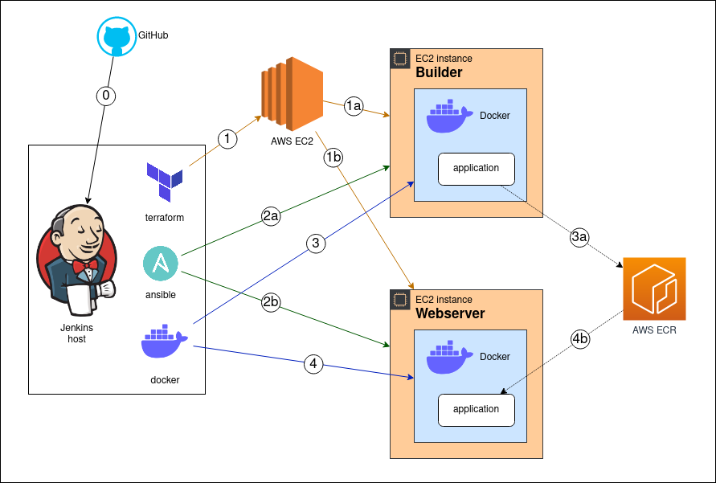

# devops-cert_task

## Certification task of DevOps Engineer course [https://devops-school.ru/devops_engineer.html](DevOps School)

Jenkins pipeline to build and deploy a web application on AWS EC2 resources. One instance build an application, other one starts it.

## Pipeline scheme



## Pipeline description

### Deploy

* 0 Jenkins pull this repository and processes Jenkinsfile
* 1 Terraform deploys infrastructure on AWS EC2
* 2 Ansible configures instances
* 3 Docker builds an application on the Builder instance
* 3a Docker pushes an artifact container to AWS ECR repository
* 4 Docker cleans containers on the Webserver instance
* 4a Docker pulls an artifact from AWS ECR repository and start it

Docker on the Jenkins host uses ssh endpoint to work with remote docker-socket

### Destroy

Terraform just destroy all instances. AWS ECR repository is not touched.

#### Files

1. *Jenkinsfile* (pipeline)
1. *\*.tf* (Terraform files)
1. *prepare-instances.yml* (Ansible playbook)
1. *Dockerfile, app.py, requirements.txt* (Python application)

#### Usage

1. Install **aws cli**, **terraform**, **ansible**, **Jenkins** (plugins: SSH Agent, Ansible, Terrafotm)
1. Generate ssh key and import it to the AWS EC2

    ```bash
    ssh-keygen -t rsa -C "aws-ec2-key" -f ~/.ssh/aws-ec2-key
    aws ec2 import-key-pair --key-name devops-cert_task-key --public-key-material fileb://~/.ssh/aws-ec2-key.pub
    ```

1. Create ECR repository

    ```bash
    aws ecr describe- --repository-name cert_task
    ```

1. Create Jenkins job and credentials

   Dashboard -> New job -> type Pipeline, name *devops-cert_task*  
   Pipeline Definition: Pipeline script from SCM, Git  
   Repository URL: [https://github.com/LovingFox/devops-cert_task.git](https://github.com/LovingFox/devops-cert_task.git)

   * Credentials for ssh

Kind: *SSH Username with private key*  
ID: *AWS_UBUNTU_INSTANCE_SSH_KEY*  
Username: *ubuntu*  
Key:

    ```bash
    cat ~/.ssh/aws-ec2-key
    ```

   * Credentials for AWS ECR repository

Kind: *SSH Username with private key*  
ID: *AWS_ECR_CREDENTIALS*
Username: *AWS*  
Password:

    ```bash
    aws ecr get-login-password
    ```

   * Credentials for AWS API

Kind: *Secret text*  
ID: *AWS_ACCESS_KEY_ID*  
Secret: \<Your AWS Access Key ID\>  

Kind: *Secret text*  
ID: *AWS_SECRET_ACCESS_KEY*  
Secret: \<AWS Secret Access Key\>  
